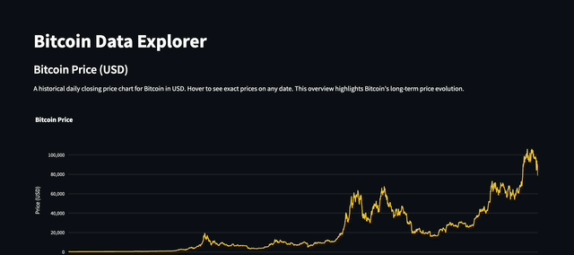

# Bitcoin Data Explorer
**A real-time interactive analytics suite for Bitcoin price data, integrating S&P 500 comparisons, Google Trends, and powerful technical indicators.**

---

## 1. High-Level Overview

Bitcoin’s price can appear chaotic, but effective analysis reveals meaningful patterns. This project tackles the challenge of **daily BTC data updates** by displaying **near-real-time** market information through seamless integration with `yfinance`. It correlates Bitcoin’s performance with **S&P 500** metrics and *visualizes* **Google Trends** interest, creating a live snapshot of market behavior.

A dashboard showcases **Bollinger Bands**, **RSI**, and **Moving Averages**, as well as fun stats like *longest winning and losing streaks*. With **built-in ROI calculations** and **auto-refreshing** charts, this project provides a continuous *“what-if”* lens on Bitcoin’s market movements.

---

## 2. Key Features

- **Real-Time / Auto-Refreshed Data**  
  - The dashboard continuously fetches up-to-date Bitcoin and S&P 500 data via `yfinance`.
  - Google Trends scores for "Bitcoin" search interest are updated daily, ensuring all visuals reflect the latest market sentiments.

- **Comprehensive Technical Indicators**  
  - **Moving Averages (7, 21, 30-day)**  
  - **RSI** (Relative Strength Index)  
  - **Bollinger Bands**  
  - Longest winning/losing streak tracking, with exact start and end dates.

- **ROI Calculator**  
  - Enter any start/end date and investment amount to see the hypothetical profit/loss and overall ROI.

- **Interactive Visuals**  
  - Plots generated, enabling hover details and dynamic toggling of indicators.  
  - Side-by-side comparisons of Bitcoin vs. S&P 500 and Bitcoin vs. Google Trends.

- **Historical Fun Facts**  
  - Automatic identification of all-time price highs/lows and *most volatile* daily percentage moves.

---

## 3. Tech Stack

- **Streamlit** – Interactive UI for real-time data exploration  
- **Pandas** – Data manipulation, cleaning, and merging multiple sources  
- **Plotly** – High-quality, interactive chart rendering  
- **yfinance** – Automated data ingestion for both BTC and S&P 500  
- **pytrends** – Programmatic interface for Google Trends data  
- **Python** – Core language for data processing  

A minimal set of dependencies is pinned in **`requirements.txt`**.

---

## 4. Quick Tour (Demo/GIF/Overview)

[**Demo link**](https://bitcoin-data-explorer-mazen.streamlit.app/)

### Overview

1. **Landing Page – BTC Price Timeline**  
   - Instantly see the historical closing price of Bitcoin, with hover-enabled data points.

2. **Investment Calculator**  
   - Enter a date range and investment size. Discover the hypothetical outcome if you had *HODLed* during that time.

3. **Indicator-Loaded Chart**  
   - Toggle RSI, Bollinger Bands, and multiple Moving Averages in real time.  
   - Perfect for analyzing potential entry/exit signals or volatility.

4. **BTC vs. S&P 500**  
   - Overlaid chart to quickly assess any correlation (or lack thereof) between Bitcoin and traditional markets.

5. **BTC vs. Google Trends**  
   - Compare price movements to Google search interest for “Bitcoin.”  
   - Useful for spotting potential hype-driven price surges.

6. **Fun Facts Section**  
   - Quick “all-time high” or “longest winning streak” stats, because *sometimes you just want the record-breakers*.

---

## 5. Project Architecture

1. **Data Refresh Layer**  
   - **`get_updated_df()`** grabs new Bitcoin price data from Yahoo Finance.  
   - **`get_updated_sp()`** does the same for the S&P 500.  
   - **`get_updated_trends()`** automates fetching Google Trends data.

2. **Processing & Indicators**  
   - Merges old/new data, cleans columns, handles missing values.  
   - Computes advanced metrics: daily % changes, RSI, Bollinger Bands, and rolling MAs.

3. **Dashboard**  
   - **Streamlit** app (in `main.py`) orchestrates all visual components and user interface elements.

4. **Storage**  
   - Local CSV files in a `/data` folder track updated price data.  
   - Ensures the pipeline can re-run daily with minimal overhead.

---

## 6. Possible Next Steps

- **Enhanced Market Coverage**  
  - Incorporate additional indexes (NASDAQ, Dow Jones) or altcoins (ETH, LTC) for broader comparisons.

- **Sentiment Analysis**  
  - Expand the Google Trends approach to parse *Twitter* or *Reddit* sentiment signals.

---

## 7. Contributing

Issues and pull requests are always appreciated. If you find a bug or have a feature request, please [open an issue](#) or submit a PR.

---

**This project simplifies the daily chaos around Bitcoin’s price by systematically mining data, applying core statistical measures, and visually presenting the outcomes in a user-friendly way.** Happy exploring!